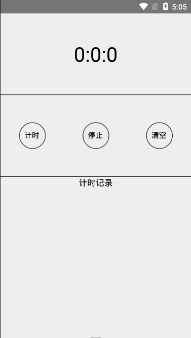
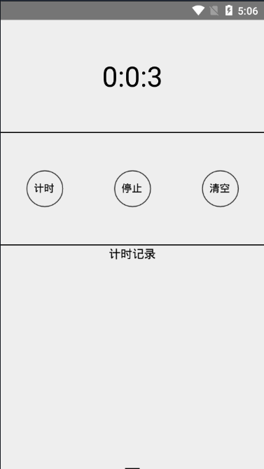
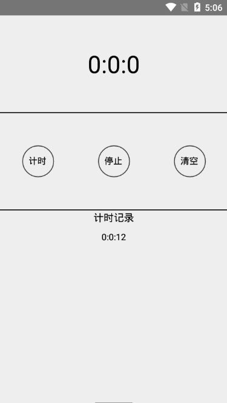

# 自己学习react-native途中做的一点小东西，都比较简单，记录下自己的学习历程
  
# Day1 a simple calculator for Android by DK
第一个是一个简易的计算器apk，由于本本是windows，所以只做了安卓版本的，IOS的暂时不考虑，本来想实现比较酷炫的动态效果，最后觉得没太大必要，
浪费时间又不实用，所以只做了简单的计时，停止计时，记录时间和清空记录时间这4个功能。  

  
# Day2 a newsApp for Android by DK
第二个是一个简单的新闻apk，借用了大佬的免费接口获取真实新闻，模仿了现在的app现状，加入了启动时候的广告页，done效果：广告页延时跳过，点击跳过，新闻页自动获取新闻，每页展示10条新闻（包括图片，标题和时间），下拉刷新10条新的新闻。todo效果：下拉刷新的蒙版层，整体样式优化，下拉查不到数据的展示语。  

  
# Day3 a waterfalls flow imageApp for Android by DK
第三个是一个简单的美图apk，借用了大佬的免费接口获取真实新闻，模仿了现在的app现状，加入了启动时候的广告页，done效果：广告页延时跳过，点击跳过，美图页自动获取美图，每页展示10条美图，下拉刷新10条新的美图。todo效果：下拉刷新的蒙版层，整体样式优化，下拉查不到数据的展示语，美图样式瀑布流（想用FlatList实现，结果就成了如图的样式，感觉不够完美，之后花时间完成瀑布流布局）  

  
